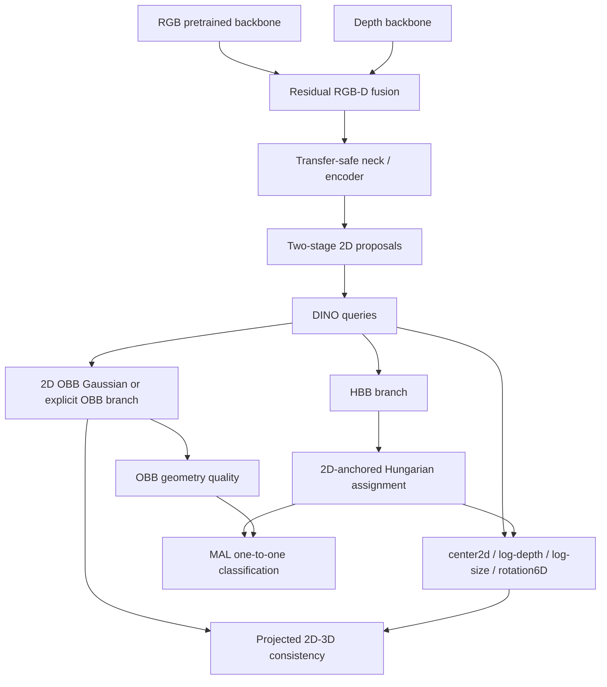

# D-FINE / DEIM / O²-DEIMを用いたRGB-D 2D OBB・3D OBB改善設計

最終更新: 2026-08-26
対象リポジトリ: `/home/kasm-user/Desktop/YOPO_clone` (`rgb-d`)
状態: 第一実装・検証完了、新規差分をMAL + `hbb_iou`に限定したFULL trainingを実行中（2026-08-26開始）

## 1. 結論

YOPOの次の改善は、2D検出と3D姿勢を別モデルへ分断するのではなく、同じquery identityを
維持したまま、監督信号を役割別に強くする。

最初のFULL trainingは、Stage 8 checkpointから開始し、新規componentのうち
MAL + `hbb_iou`だけを有効化した構成とする。既存のDINO denoising、Gaussian GWD補助、
pose/projection/CoP lossは引き続き有効であり、「MAL-only」はモデル全体のlossがMALだけという意味ではない。

1. 現行のRGB-D residual backbone、pretrained-compatible neck、DINO decoder、CoP pose chainを維持する。
2. Hungarian assignmentの基準を2D HBBへ固定し、初期からtranslation/rotationでquery identityを動かさない。
3. 分類をMatchability-Aware Loss（MAL）へ変更し、detachedなHBB IoUだけをquality targetとしてscoreを較正する。
4. `obb_gwd` qualityとのblend、box-only Oriented Contrastive Denoising（OCD）、明示5D OBB向けChamferは実装済みの任意機能として保持し、個別GPU smokeを通すまでFULLへは入れない。
5. 以上が改善した後だけ、D-FINE/O²-DFINE型の6分布refiner、GO-LSD、full HybridEncoderへ進む。

この順序は、過去checkpointとの互換性、現在の実測AP、密な果実データのquery予算、RGB-Dの
camera geometryを同時に守る最短経路である。

## 2. ユーザー要求を設計要件へ変換する

| ユーザー要求 | 設計上の要件 |
|---|---|
| まず2D BBoxのIoUを担保したい | assignmentとquery生存判定のanchorを2D HBB/OBBに置く |
| 2D OBBと3D OBBを一貫させたい | 同一query indexの2D/3D出力を分離・再対応付けしない |
| GWDでOBBがうまく学習できた | GWDを回帰と初期qualityの連続信号に残す |
| NMS-freeにしたい | clsはone-to-oneを維持し、raw全query経路でNMS-free品質を測る。現段階の3D運用経路は安全側として2D NMSを残す |
| encoder/decoderの質を上げたい | 転送済みRGB経路を壊さず、matching・denoising・refinementから改善する |
| FULL trainingを回したい | 単体試験、1–2 iteration GPU smoke、短期gateを通してから長期runへ進む |
| RGB-Dと3D annotationを壊したくない | camera geometryを破壊するnaive Mosaic/MixUpを3D stageでは使わない |

## 3. 現在地

### 3.1 採用中の経路

```text
RGB HGNetV2-B2 pretrained features ───────────────┐
                                                   ├─ RGB + beta[level] * depth
Depth HGNetV2-B0 + adapters、beta初期値0 ─────────┘
  -> pretrained-compatible multi-level neck
  -> deformable encoder / two-stage proposal top-K
  -> DINO decoder、Q=256
  -> per-query HBB + center2d + depth + size + rotation6D
  -> CoP chain
  -> per-query compact 2D OBB Gaussian auxiliary
  -> projected 3D ellipsoid / GWD consistency
```

重要な実装事実は、現行3D headの2D OBB表現が明示的な
`(cx, cy, w, h, theta)`ではなく、compact Gaussian
`(cx, cy, sigma_xx, sigma_xy, sigma_yy)`である点である。
したがって、5D OBB専用のChamfer costを現行headへ直接差し込むことはできない。
Gaussian経路ではGWD/KLD、明示5D OBB経路ではChamferを使い分ける。

### 3.2 旧operating/filtered baseline

| run | 2D AP50 | 3D IoU@0.50 | pose 10deg/10cm | 備考 |
|---|---:|---:|---:|---|
| Stage 7 detection repair best | 0.54219 | 0.42792 | - | conf 0.2 / NMS 0.3 |
| Stage 8 geometry repair best | 0.50240 | 0.52966 | 0.22560 | conf 0.3 / NMS 0.375 |
| Stage 9 | plateau | plateau | plateau | 同じ経路の延長では飽和 |

根拠ログ:

- `work_dirs/nocs_fruits_736x512_rgbd_3dbbox_stage7_detection_repair_continue65/20260826_061448/vis_data/scalars.json`
- `work_dirs/nocs_fruits_736x512_rgbd_3dbbox_stage8_geometry_repair_continue10/val_dump_best_3d_epoch10/20260826_082452/vis_data/scalars.json`

上表はそれぞれ異なるscore/NMSを使った運用経路の値である。Stage 10のraw HBB APは
score threshold 0、NMSなしの256 query全件を評価するため、上表と直接比較しない。

Stage 10と同じdiagnostic契約で数えたvalid splitのGTは24,794個 / 330画像、
平均75.13個、median 68個、p95 132個、最大205個で、Q=256内に収まる。
この密度はDEIMのDense O2Oで有効だった約25 objects/imageより既に高い。4-image Mosaicは
query予算超過、小物体化、複数intrinsic混在を起こすため、3D FULL trainingには採用しない。

### 3.3 実装・検証の現在地（2026-08-26）

次の独立componentは実装済みでregistryからexportされている。

- `MatchabilityAwareLoss`（MAL）
- `MatchabilityQualityPolicy`（`hbb_iou`、`obb_gwd`、`blend`を選択可能）
- `OBBChamferCost`（explicit 5D OBB用。compact Gaussian headへは直接接続しない）
- `BoxOnlyOCDNoise`（HBBだけを摂動し、angle/3D pose属性を変えない）

DINO pose headのclassification adapterはFocal、QFL、MALを設定互換に選択できる。
`tools/test.py`はtrain-only configにも対応するfallbackを持つ。統合直後のfocused test 120件に加え、
ScheduleFreeとno-DN修正後の最終選定回帰試験113件が成功し、ruffと対象diff確認も成功した。
GPU smokeはfiniteかつOOMなしで完了し、peak memoryは約28.1 GiBだった。

新規componentのうちFULLに有効なのはMAL + `hbb_iou`だけである。`blend`、custom OCD、
Chamfer、6分布refinerは**未採用**であり、それぞれを有効化する前に独立したGPU smokeを
必要とする。一方、既存のDINO DNは有効で、dynamic `num_dn_queries=20`とlegacy
`box_noise_scale=1.0`を使う。Chamferは構造上、compact Gaussian 2D OBB headへの直接適用対象ではない。

## 4. 参照論文から採るもの・採らないもの

### 4.1 D-FINE: Fine-grained Distribution Refinement

一次資料: [arXiv 2410.13842](https://arxiv.org/abs/2410.13842)、
[公式実装](https://github.com/Peterande/D-FINE)

採るもの:

- 各decoder層で絶対boxを再回帰せず、初期boxに対する辺の分布残差を累積する考え方。
- 4辺のFDR、FGL、最終層から浅層へのdistribution distillation。
- localizationのmatching unionとclassification one-to-oneを分離するGO-LSD。
- AP50だけでなくAP75、AP50:95、層別IoU、分布entropyを評価する視点。

そのまま採らないもの:

- RGB/HBB用4辺分布を3D rotationへ機械的に拡張しない。
- 最終層が十分良いという前提なしにDDFを有効化しない。
- 既存の転送済みneckを一度にGELAN/HybridEncoderへ置換しない。

### 4.2 DEIM: Dense O2O and Matchability-Aware Loss

一次資料: [arXiv 2412.04234](https://arxiv.org/abs/2412.04234)、
[公式実装](https://github.com/Intellindust-AI-Lab/DEIM)

MALのpositive targetを`q^gamma`、negative weightを`p^gamma`とする。

\[
L_{MAL}(p,q,y)=
\begin{cases}
-q^\gamma\log p-(1-q^\gamma)\log(1-p), & y=1 \\
-p^\gamma\log(1-p), & y=0
\end{cases}
\]

実装不変条件:

- `q`とnegative weightはstop-gradientする。
- matched positiveは`q=0`でもpositive branchであり、backgroundにしない。
- MALはscore calibrationであり、box regression lossの代替ではない。
- geometry距離はfloat32で計算し、NaN/Infを黙って0へしない。

本データではDense O2O augmentationではなくMALを先に採用する。既に十分にdenseであり、
Mosaic/MixUpはcamera/depth契約を壊すためである。

### 4.3 O²-RTDETR / O²-DFINE / O²-DEIM

一次資料: [arXiv 2603.15497](https://arxiv.org/abs/2603.15497)

採るもの:

- 4頂点Chamferを回帰lossではなくHungarian matching costとして使う。
- small-noise positive / large-noise negativeを作るbox-only OCD。
- OBB sampling点を`c + R(theta)(offset * [w,h]/2)`で回転するcross-attention。
- HBB外接4辺 + OBB頂点offset 2本を分布化するADRの考え方。

注意点:

- 論文式Chamferはsquared L2、公開コードはunsquared L2である。variantを明示する。
- 正方形や回転対称な果実で角度差を強く罰するとannotation noiseを増幅する。
- ADR公開実装は確認できず、論文式からテスト付きで実装する必要がある。
- 公開rotation-aware attention式には回転とscaleの順序が疑わしい箇所があるためコピーしない。

## 5. 採用アーキテクチャ



### 5.1 Query identity契約

query `q`は次の全属性を同じindexで保持する。

```text
q = {class, HBB, 2D OBB, center2d, depth, size3D, rotation3D, geometry_quality}
```

- 2D選択後に3D boxを別matchingしない。
- 2Dで残ったqueryと同じindexの3Dだけを返す。
- classification assignmentはone-to-oneのままにする。
- localization unionを将来導入しても、classification positiveは増やさない。

### 5.2 2D-anchored assignment

初期FULL候補のmatching costは次とする。

\[
C_{ij}=2C_{cls}+5C_{HBB-L1}+2C_{GIoU}
+\lambda_o C_{OBB}
\]

- compact Gaussian head: `C_OBB = GWD/KLD`。
- explicit 5D OBB head: `C_OBB = Chamfer + KLD/GWD`。
- translation/rotation costは初期matchingから除外する。
- 3D属性は2Dで得た対応を共有し、別のGTへqueryを乗り換えさせない。
- 3Dが安定した後だけ、正規化center/depthを小さいweightで追加検討する。

### 5.3 OBB-MAL quality

HBB IoUを`q_h`、compact Gaussianの正規化GWD距離を`d_g`とし、

\[
q_g = \frac{1}{1+d_g},\qquad
q_t=(1-\lambda_t)q_h+\lambda_t q_g
\]

をdetachしてMALへ渡す。どちらも`[0,1]`であり、初期は`lambda_t=0`、短いwarm-in後に
`0.25–0.5`まで上げる。explicit OBBでstable rotated IoUが得られる場合は後半だけ
`q_g`をrotated IoUへ置換または混合する。

分類scoreを一つに潰しすぎないため、最終的には次を分ける。

- `score_det`: HBB/2D OBBの存在と局在品質。
- `score_geom`: 3D geometryの信頼度。positive queryだけで学習。
- 2D rankingは`score_det`、3D rankingは`score_det * score_geom^beta`。

第一実装ではparameter互換性を優先して`score_det`だけをMAL化する。

### 5.4 Box-only OCD

denoising positiveはGT HBBへsmall noise、negativeはlarge noiseを入れる。

- `xyxy`または等価な`cxcywh`空間だけを摂動する。
- 2D OBB angle、3D rotation、depth、sizeはGTのまま固定する。
- positive:negativeは1:1。
- clip後に最小幅・高さを保証する。
- 生成slot数、clip率、invalid数を記録する。
- 既定noise scale候補はpositive 1.0、negative 2.0。既存DINOとのscale対応をunit testする。

### 5.5 Symmetry-aware 4-corner Chamfer

explicit OBBを4頂点集合`S,T`へ変換し、

\[
D_{cf}(S,T)=\frac{1}{4}\sum_{s\in S}\min_{t\in T}\|s-t\|_2^r
+\frac{1}{4}\sum_{t\in T}\min_{s\in S}\|t-s\|_2^r
\]

とする。`r=2`がpaper variant、`r=1`が公開code variantである。

- xを画像幅、yを画像高さで正規化する。
- 4頂点だけを使う。
- angle canonicalizationへ依存しない。
- category symmetryや`w/h` swap候補が定義される場合は候補costのminimumを取る。
- fruitのanisotropyが低い場合はangle-sensitive costを弱める。

Chamferはmatching costであり、既存のSmoothL1 + rotated IoU → GWD curriculumを置換しない。

## 6. D-FINE/O²-DFINE型の次段refiner

第一実装がgateを通った後、2D OBBを統一した6分布で反復refineする。

```text
external HBB edges: top, bottom, left, right
OBB geometry: top-edge vertex offset, right-edge vertex offset
distribution bins: N + 1、既定 N=32
```

decoder層`l`で前層logitsへ残差を加え、固定した初期box基準から期待値をdecodeする。

\[
P_l=softmax(Z_{l-1}+\Delta Z_l),\qquad
D_l=D_0+s(D_0)\sum_n A(n)P_l(n)
\]

実装契約:

- traditional HBB/OBB headで初期boxを作りdetachする。
- distribution headはzero correctionとなるよう初期化する。
- decoded HBBを次層deformable attention referenceとdepth ROIへ使う。
- OBBの角度表現を線形angle binにしない。
- FGL weightの開始値は0.15。
- bin外飽和率、entropy、期待値誤差をログする。

3D属性は同じ6分布へ詰め込まない。空間ごとに残差を定義する。

\[
\log z_l=\log z_0+\delta z_l,
\qquad
\log s_l=\log s_0+\delta s_l,
\qquad
R_l=\exp([\delta\omega_l]_\times)R_{l-1}
\]

center2dは2D box幅・高さで正規化し、rotationはSO(3)接空間で小残差だけを扱う。

## 7. RGB-D encoder / neck改善の順序

full HybridEncoderは有望だが、同時にmatching/headを変えると寄与が分離できず、転送済み特徴を
失う。次の順で進める。

1. 現行neckのままMAL + 2D assignment + OCDを検証。
2. refined HBBをdepth ROIへ接続。
3. stride 8/16/32のprojected featureに、top-level attention + CNN cross-scale fusionを追加。
4. depthは各levelでresidual gateし、`beta=0`のRGB恒等性を保つ。
5. encoder proposal recall、small-object recall、feature transfer exactnessを比較する。

full HybridEncoder採用条件は、AP50だけでなくAP75/AP50:95、proposal recall、3D IoUを改善し、
RGB-only checkpoint転送率を維持することである。

## 8. 3D一貫性

### 8.1 投影loss

3D OBB/ellipsoidをcamera intrinsicで2Dへ投影し、観測2D OBB GaussianとGWDで比較する。

\[
L_{proj}=w_{vis}\,D_{GWD}(\Pi_K(B^{3D}),B^{2D}_{obs})
\]

初期は既存どおりtarget center/depth/sizeを使いdetachし、rotationだけを安全に整える。
予測geometryへ移す順はcenter、depth、sizeの順であり、一度にdetachを外さない。

### 8.2 対称性

回転対称群`G`が定義される対象は、

\[
d_G(R_p,R_g)=\min_{g\in G}d_{SO(3)}(R_p,R_g g)
\]

で評価・学習する。`symmetric_classes=[]`を単なる既定値として固定せず、データ定義に
stem方向が含まれるかを確認する。2D OBBがほぼ円形ならanisotropyでrotation/Chamfer weightを
下げる。

### 8.3 Depth sampling

現在のHBB ROI samplingは回転物体の背景を多く含む。refined explicit OBBが安定した後、
sampling gridを次式で回転する。

\[
p=c+R(\theta)(\Delta p\odot[w,h]/2)
\]

0、45、90度と正方形/長方形のunit testを必須とする。

## 9. Curriculum

### Phase A: 互換性を保つ検出改善

- Stage 8/2D bestからweights-onlyで開始。
- 2D-only Hungarian assignment。
- MAL qualityはHBB IoU固定で開始する。`obb_gwd` blendは別probeで判断する。
- box-only OCDは別GPU smokeと単独probeを通過するまで無効にする。
- SmoothL1 + GIoU +既存GWD auxiliaryを維持。
- 5 epoch probe後、gate通過時だけ50–100 epochまたはplateauまでFULL training。

### Phase B: OBB geometry改善

- explicit 5D OBB headではChamfer + KLD/GWD matcherを0からramp。
- SmoothL1 + rotated IoUでoverlapを作る。
- 後半はGWD比率を増やす。
- F1最適conf、OBB AP50/75、angle/symmetry-aware errorを再較正する。

### Phase C: Distribution refinement

- 6-distribution refiner + FGL。
- 最終層が最良と確認できた場合だけlocalization union + DDF。
- clsは全期間one-to-one。

### Phase D: 3D geometry

- refined 2D boxをdepth ROIとCoP conditionへ接続。
- log-depth、log-size residual。
- SO(3) tangent refinement。
- prediction-based projection consistencyを段階的に有効化。

## 10. 評価契約

### 10.1 必須metrics

- HBB: AP50、AP75、AP50:95、recall、precision。
- OBB: rotated mAP50/75、GWD、symmetry-aware angle error。
- NMS-free: score–IoU Spearman、positive/background AUC、duplicate率、pre-NMS全query。
- assignment: decoder層間GT→query変更率、未割当GT、GT数がQを超える画像数。
- 3D: 3D IoU@0.25/0.50/0.75、pose 5/10度 × 2/5/10cm、360度対称指標。
- stability: NaN/Inf、gradient norm、GPU peak memory、iteration time。

#### NOCSMetricの評価経路

HBBのraw診断と実運用の3D評価を混同しない。

- raw HBB all-query評価: `score_thr=0`、NMSなし。score calibration、全query recall、duplicateを観測する。
- operating 3D評価: `score_thr=0.2`、NMS IoU threshold `0.3`。3D IoUとposeの運用値を報告する。
- `AP50_95`はIoU `0.50, 0.55, ..., 0.95`の10個のVOC-area APの算術平均である。COCO evaluatorの
  `AP@[.50:.95]`と同じ名称であっても、その厳密な実装ではない。

### 10.2 第一実装の採用gate

controlと同じcheckpoint、seed、epochsで比較し、次を満たすこと。

- AP50を`-0.005`より悪化させない。
- AP75またはAP50:95を改善する。
- score–IoU Spearmanを改善する。
- conf 0.2 NMS-free recallを`-0.01`より悪化させない。
- duplicate率またはNMS有無のrecall差を改善する。
- 3D IoU@0.50を`-0.005`より悪化させない。
- NaN/Inf/OOM 0。

probeでgateを満たさない構成は、FULL trainingへ進めない。MAL、matching、OCDを同時に
hard switchして失敗した場合は原因が分からないため、各機能は設定で個別に無効化できるようにする。

### 10.3 matched 1-epoch gate結果

同一checkpoint・seed・1 epochのcontrolとMAL（`hbb_iou`）を比較した。HBB値はraw all-query
経路、3D/pose値はoperating 3D経路である。

| 構成 | raw HBB AP50 | raw HBB AP75 | raw HBB AP50_95 | 3D IoU@0.50 | pose 10deg/10cm |
|---|---:|---:|---:|---:|---:|
| control | 0.3856 | 0.0588 | 0.1384 | 0.6085 | 0.2346 |
| MAL (`hbb_iou`) | 0.3875 | 0.0654 | 0.1428 | 0.6117 | 0.2421 |

| calibration / recall diagnostic | control | MAL (`hbb_iou`) |
|---|---:|---:|
| score–IoU Spearman | 0.56148 | 0.63725 |
| positive/background AUC | 0.71849 | 0.72049 |
| no-NMS recall | 0.71187 | 0.71174 |
| NMS recall | 0.66476 | 0.66702 |
| NMS recall gap | 0.04711 | 0.04473 |

AP50、AP75、AP50_95、3D IoU、pose、score calibration、NMS recall gapの全gate条件を満たしたため、
新規差分がMAL + `hbb_iou`だけの構成はFULLへ進めた。no-NMS recallは0.00013低下したが、
許容下限（-0.01）内である。
5-epoch MAL probeの旧filtered AP50ではepoch 3のbest AP50が0.5800、epoch 2のbest 3D IoUが
0.6204だった。この旧filtered AP50は上表のraw HBB APとは評価設定が異なるため直接比較しない。

### 10.4 現在のFULL run

2026-08-26にStage 8 checkpointからfresh FULLを開始した後、ScheduleFree optimizerの
validation mode切替欠落を独立監査で検出した。旧epoch 5/10評価はtrain-mode weightを使っていたため
正式なbest/early-stop判定から除外し、ログだけを監査証跡として保全する。

`ScheduleFreeOptimizerModeHook`はvalidation前に`optimizer.eval()`で平均化weightへ切り替え、
CheckpointHookとEarlyStoppingHookが動く`after_val_epoch`の後、`after_val`でtrain weightへ戻す。
epoch 10 / iter 600のmodel・optimizerはexactに維持し、旧validation scalarとbest/checkpoint履歴だけを
resetしたartifactから、fresh workdir
`/home/kasm-user/Desktop/YOPO_clone_artifacts/work_dirs/stage10_2d_anchor_mal_full_schedulefree_fixed_v2`
へ再開した。最初のauthoritative evaluationはepoch 15である。

最大100 epoch、validation interval 5、EarlyStoppingは`AP50_95`、`min_delta=0.002`、patience 6である。
`TMPDIR`とuv cacheは`/workspace`の空き約245 MiBを避け、Desktop artifact root配下を使用する。

最初のauthoritativeなepoch 15評価は次のとおりである。

| epoch | raw HBB AP50 | raw HBB AP75 | raw HBB AP50_95 | 3D IoU@0.50 | pose 10deg/10cm |
|---:|---:|---:|---:|---:|---:|
| 15 | 0.4089 | 0.0777 | 0.1547 | 0.6069 | 0.2295 |

保存された`epoch_15.pth`のoptimizerは`train_mode=False`で、best weightが平均化weightであることを
確認した。直後にepoch 16のtraining stepが成功したため、`after_val`でtrain weightへ戻る契約も
実動確認済みである。

正確なresume用はoptimizer stateを含むperiodic `epoch_N.pth`またはsanitized resume artifactである。
`best_*.pth`は平均化model weightだけを保存する評価/配布用で、optimizer stateを含まない。
`max_keep_ckpts=2`はperiodic checkpointだけを制限し、metric別bestは別に残る。

raw出力は330画像すべてで256 query、計84,480件を保持するため、現状を「完全なNMS-free推論が
完成した」とは扱わない。MALによりrankingは改善したが、運用3Dでは引き続き2D NMS後の同一query
indexだけを残す。NMSを外す判断は、FULL bestでduplicateとrecall gapを再評価してから行う。

## 11. 実装境界

| 部品 | 責務 | checkpoint影響 |
|---|---|---|
| `MatchabilityAwareLoss` | detached qualityによるcls calibration | parameter追加なし |
| OBB quality target helper | HBB IoU / Gaussian GWD / 両者のblend | parameter追加なし |
| `OBBChamferCost` | explicit OBB Hungarian geometry | parameter追加なし |
| box-only OCD helper | positive/negative DN reference生成 | parameter追加なし |
| head integration | lossとquality sourceの選択 | 原則shape互換 |
| six-distribution refiner | HBB/OBB反復補正 | 新parameter、別config |
| rotation-aware sampler | OBB-aligned attention/depth ROI | 新parameterまたは演算変更 |

第一実装では既存configの挙動を完全に保ち、新しいtype/optionを指定した時だけ新経路を有効にする。

### 11.1 モジュール設計原則

実装は次の境界を守る。

- SOLID: lossは分類式、quality policyは幾何品質、matcherは対応付け、DN strategyはnoise生成だけを担当する。
- KISS: 継承階層を増やさず、小さいstateless componentと一つのhead adapterで接続する。
- DRY: HBB IoU、Gaussian GWD、positive mask、classification dispatchを各loss箇所へ複製しない。
- 可搬性: configへhost固有の絶対pathを埋めず、checkpoint/output rootはCLIまたは環境で与える。
- 再利用性: componentはpose head固有のTensor配置へ依存せず、入力shapeと座標系を公開APIで検証する。
- Open/closed: 新quality sourceやmatcherはregistry component追加で拡張し、既存headの分岐追加を最小化する。
- 後方互換: 新option未指定時のparameter、forward、loss、checkpoint keyを変えない。

設定面では少なくとも次を独立に変更できるようにする。

```python
model = dict(
    bbox_head=dict(
        loss_cls=dict(type='MatchabilityAwareLoss', gamma=1.5),
        quality_target=dict(
            type='MatchabilityQualityPolicy',
            source='blend',
            obb_weight=0.25,
            missing_obb='hbb_iou',
        ),
    ),
    train_cfg=dict(
        assigner=dict(match_costs=[...])),
    dn_cfg=dict(
        box_noise=dict(type='BoxOnlyOCDNoise', ...),
        ...,
    ),
)
```

componentを無効化するには、旧loss typeへ戻す、costをlistから外す、DN strategyをlegacyへ戻す、
のいずれかだけでよい。コード編集をrollback手段にしない。

### 11.2 ストレージ配置

2026-08-26の最新確認で`/workspace`は60 GiB中60 GiB使用、空き約245 MiBである。一方、Desktop側の
overlayには約114 GiBの空きがある。既存の`/workspace`内checkpoint、venv、uv cacheは参照中の
可能性があるため移動・削除せず、今後の重い生成物だけを次へ置く。

```text
/home/kasm-user/Desktop/YOPO_clone_artifacts/
  work_dirs/   # probe/FULL checkpoint、log、prediction dump、overlay
  tmp/         # torch compile、評価、archiveの一時領域
  uv-cache/    # 新規sync/build時にUV_CACHE_DIRで指定
```

configにはこの絶対pathを固定せず、実行時に`--work-dir`、`TMPDIR`、`UV_CACHE_DIR`で指定する。
既存repo内`work_dirs`は`/workspace`へのsymlinkなので、新規runで暗黙利用しない。

## 12. 非目標

- 3D camera geometryを無視したMosaic/MixUpを導入しない。
- 2D/3Dを別queryへ再matchingしない。
- MALを回帰lossの代わりにしない。
- Chamferを既存GWD curriculumの代わりにしない。
- AP50だけを見てFDR/ADRを不採用にしない。
- NaN/Infを`nan_to_num`で隠して学習を継続しない。
- 一度のrunでbackbone、neck、matcher、loss、decoderを全交換しない。

## 13. 関連文書

- [既存RGB-D OBB architecture](./rgbd_obb_modular_architecture_ablation_design.md)
- [NMS-free query architecture](./nms_free_rgbd_query_architecture.md)
- [投影GWD理論](./projected_ellipsoid_gwd_rotation_consistency.md)
- [本設計の実装作業記録](./dfine_deim_o2deim_implementation_worklog.md)
